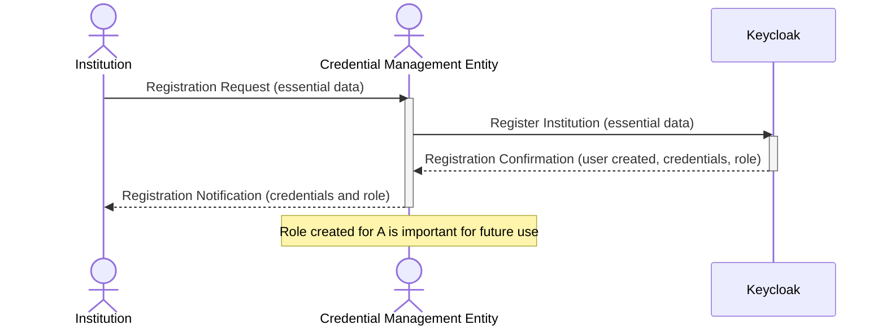

# ATM Demo


## Sample flows

### Registration Flow Sequence Diagram



## Build Native Camel Quarkus
```shell
podman build -f docker-images/Dockerfile-camel-quarkus.multistage -t quay.io/masales/atm-camel-quarkus-native:latest .
```

## References
* https://docs.redhat.com/en/documentation/red_hat_amq_broker/7.12
* https://docs.redhat.com/en/documentation/red_hat_amq_broker/7.12/html-single/deploying_amq_broker_on_openshift/index#proc-br-configuring-jaas-login-modules-for-authentication_broker-ocp
* https://docs.redhat.com/en/documentation/red_hat_amq_broker/7.12/html-single/configuring_amq_broker/index#idm139623346509920
* https://docs.redhat.com/en/documentation/red_hat_amq_broker/7.12/html-single/deploying_amq_broker_on_openshift/index#con-br-segregating-broker-properties_broker-ocp
* https://github.com/apache/activemq-artemis-examples
* https://kubernetes.io/docs/tasks/administer-cluster/access-cluster-api/#java-client
* https://github.com/rh-messaging
* https://eur-registry.swim.aero/services/eurocae-arrival-sequence-service-102/arrival-sequence-service-performance-standard
* https://www.eurocontrol.int/publication/eurocontrol-specification-swim-service-description-sd
* https://sparxsystems.com/products/ea/downloads.html
* https://medium.com/javarevisited/keycloak-integration-with-spring-security-6-37999f43ec85
* https://quarkus.io/guides/security-openid-connect-client
* https://quarkus.io/guides/deploying-to-openshift#log-into-the-openshift-cluster