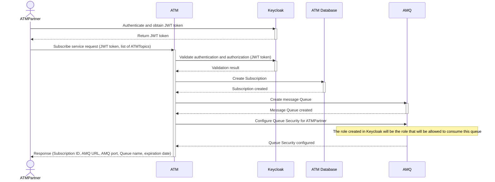
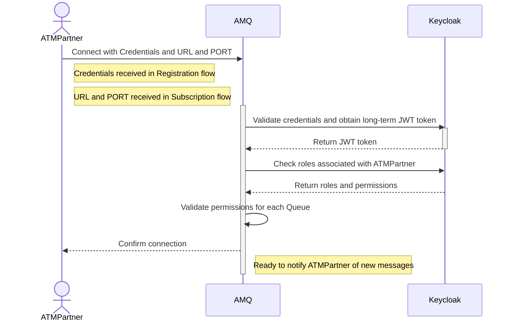
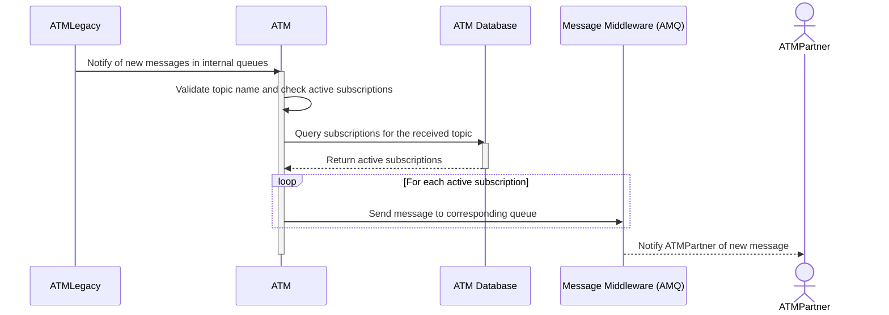
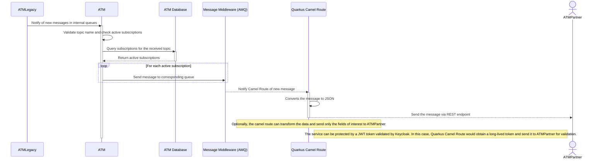
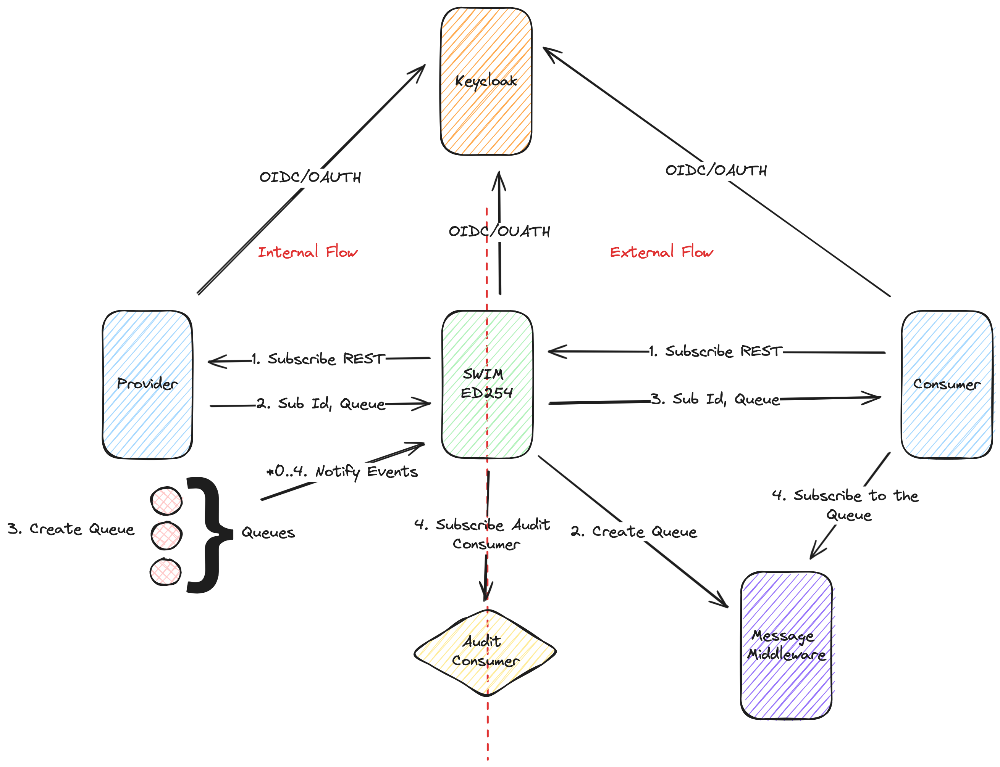
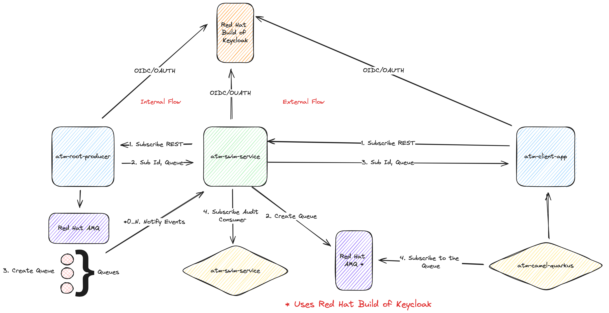
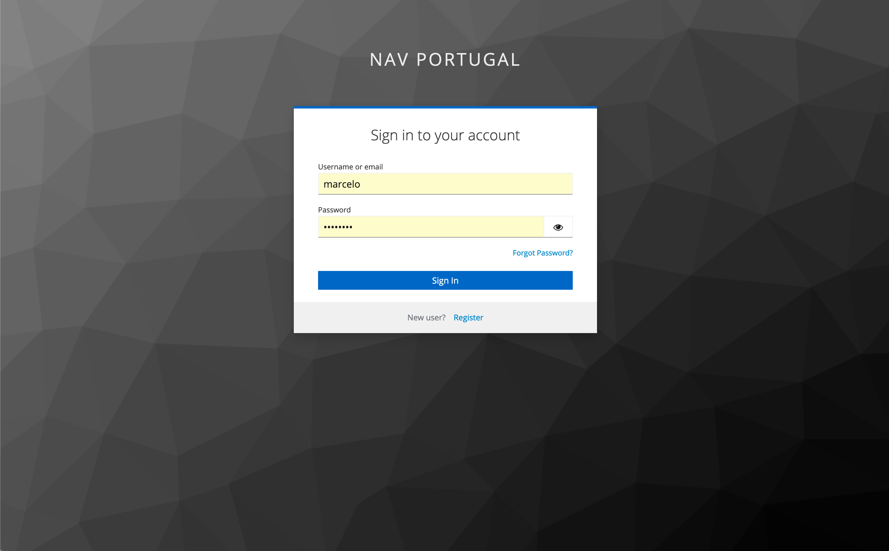
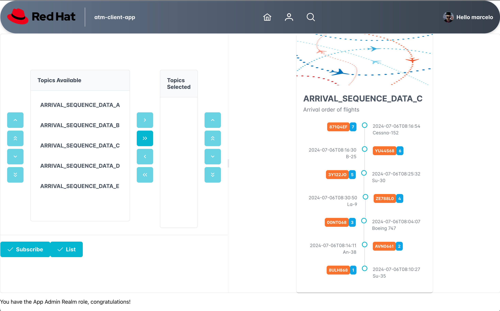
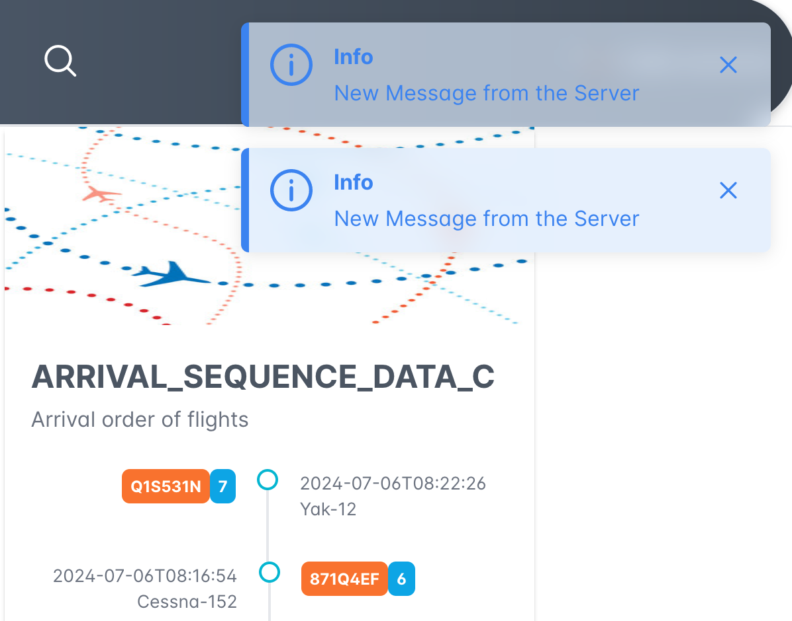

# ATM Demo

## Project Description

This project represents the work developed to fulfill a proof of concept with the following definition:

An institution called ATM that has information generically referred to as ATMTopics. These ATMTopics are generated by an internal solution called ATMLegacy with confidential data. ATM must offer this internally generated data to external collaborators known as ATMPartners. It is ATM's responsibility to distribute this data securely and ensure that only properly registered and validated ATMPartners have access to this information. There are some legal requirements that ATM needs to comply with, such as:

* ATM must provide a REST API for ATMPartners to subscribe to ATMTopics of interest.
* ATM must deliver messages about ATMTopics of interest to ATMPartners in a message queue middleware.
* ATM is restricted to using message queues and is not allowed to use topics (from an implementation perspective in the middleware).
* ATM must create a queue per subscription.
* ATM must ensure that the created queues are exclusively consumed by the ATMPartner who requested the subscription.
* ATM must build an environment that supports part of the solution developed in Spring Boot 3, which will be provided by an external institution.

Additionally, ATM presents other challenges such as:

* Establish the credentialing process flow for ATMPartner.
* Define the solution architecture.
* Determine which technologies to use to develop the solution.
* How to deploy the project in a scalable and secure environment.
* How to control the lifecycle of generated artifacts.
* How to train the internal team to be able to maintain the solution.
* Define application models and create reference architectures as well as prototypes for future implementations.


## Sample flows

### Registration Flow Sequence Diagram


### Subscription Flow Sequence Diagram


### AMQ Connection Flow


### Message consumption flow


Alternatively, the project presents a flow where ATMPartner does not connect directly to AMQ but receives notifications through a REST endpoint in JSON format. This scenario is useful in situations where ATMPartner cannot be changed or has technological or AMQ access limitations.



## Technologies used
* [Red Hat Openshift](https://www.redhat.com/en/technologies/cloud-computing/openshift) 
* [Red Hat Application Foundations](https://www.redhat.com/en/products/application-foundations)
  * [Red Hat Build of Keycloak](https://access.redhat.com/products/red-hat-build-of-keycloak)
  * [Red Hat AMQ](https://www.redhat.com/en/technologies/jboss-middleware/amq)
  * [Red Hat Build of Quarkus](https://access.redhat.com/products/quarkus)
  * [Red Hat Build of Apache Camel](https://access.redhat.com/documentation/en-us/red_hat_build_of_apache_camel)
  * [Red Hat support for Spring Boot](https://docs.redhat.com/en/documentation/red_hat_support_for_spring_boot/)
* [Postgres Database](https://www.postgresql.org/)
* [React for frontend](https://react.dev/)
* [Primereact](https://primereact.org/)

## Suggested Trainnings
* [Red Hat Agile Integration Technical Overview | DO040 **FREE**](https://www.redhat.com/en/services/training/do040-red-hat-agile-integration-technical-overview)
* [Running Containers with Red Hat Technical Overview | RH065 **FREE**](https://www.redhat.com/en/services/training/rh065-running-containers-red-hat-technical-overview)
* [Containers, Kubernetes and Red Hat OpenShift Technical Overview | DO080 **FREE**](https://www.redhat.com/en/services/training/do080-deploying-containerized-applications-technical-overview)
* [Developing Cloud-Native Applications with Microservices Architectures | DO092 **FREE**](https://www.redhat.com/en/services/training/do092-developing-cloud-native-applications-microservices-architectures)
* [Introduction to OpenShift Applications | DO101](https://www.redhat.com/en/services/training/do101-introduction-openshift-applications)
* [Red Hat OpenShift Development I: Introduction to Containers with Podman | DO188](https://www.redhat.com/en/services/training/do188-red-hat-open-shift-development-introduction-containers-with-podman)
* [Red Hat OpenShift Developer II: Building and Deploying Cloud-native Applications | DO288](https://www.redhat.com/en/services/training/red-hat-openshift-developer-ii-building-and-deploying-cloud-native-applications)
* [Red Hat Single Sign-On Administration | DO313](https://www.redhat.com/en/services/training/do313-red-hat-single-sign-on-administration)
* [Red Hat DevOps Pipelines and Processes: CI/CD with Jenkins, Git, and Test Driven Development | DO400](https://www.redhat.com/en/services/training/do400-red-hat-devops-pipelines-and-processes-with-jenkins-git-and-test-driven-development)
* [Cloud-native Integration with Red Hat Fuse and Apache Camel | AD221](https://www.redhat.com/en/services/training/ad221-cloud-native-integration-with-red-hat-fuse)
* [Red Hat Cloud-native Microservices Development with Quarkus | DO378](https://www.redhat.com/en/services/training/red-hat-cloud-native-microservices-development-quarkus-do378)

## Solution Overview


## Solution Components


## Screenshots
Login screen with Keycloak


Event screen


Event notifications (Websocket)


## Build Native Camel Quarkus
```shell
podman build -f docker-images/Dockerfile-camel-quarkus.multistage -t quay.io/masales/atm-camel-quarkus-native:latest .
```

## References
* https://docs.redhat.com/en/documentation/red_hat_amq_broker/7.12
* https://docs.redhat.com/en/documentation/red_hat_amq_broker/7.12/html-single/deploying_amq_broker_on_openshift/index#proc-br-configuring-jaas-login-modules-for-authentication_broker-ocp
* https://docs.redhat.com/en/documentation/red_hat_amq_broker/7.12/html-single/configuring_amq_broker/index#idm139623346509920
* https://docs.redhat.com/en/documentation/red_hat_amq_broker/7.12/html-single/deploying_amq_broker_on_openshift/index#con-br-segregating-broker-properties_broker-ocp
* https://github.com/apache/activemq-artemis-examples
* https://kubernetes.io/docs/tasks/administer-cluster/access-cluster-api/#java-client
* https://github.com/rh-messaging
* https://eur-registry.swim.aero/services/eurocae-arrival-sequence-service-102/arrival-sequence-service-performance-standard
* https://www.eurocontrol.int/publication/eurocontrol-specification-swim-service-description-sd
* https://sparxsystems.com/products/ea/downloads.html
* https://developers.redhat.com/articles/2023/07/24/how-integrate-spring-boot-3-spring-security-and-keycloak
* https://developers.redhat.com/articles/2024/02/12/getting-started-red-hat-build-keycloak-22
* https://developers.redhat.com/blog/2020/08/24/java-development-on-top-of-kubernetes-using-eclipse-jkube
* https://quarkus.io/guides/security-openid-connect-client
* https://quarkus.io/guides/deploying-to-openshift#log-into-the-openshift-cluster